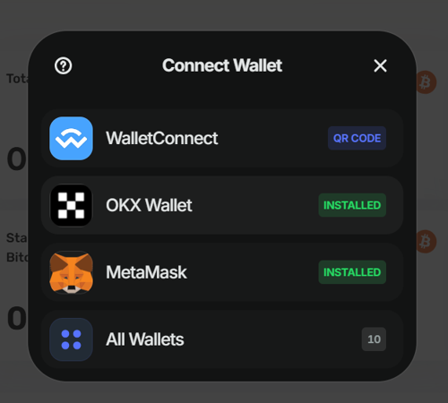
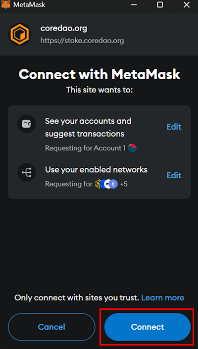
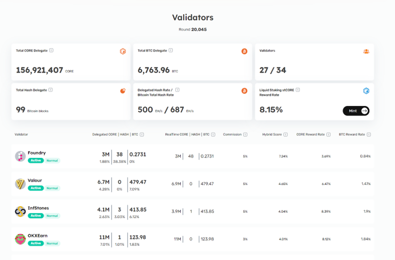
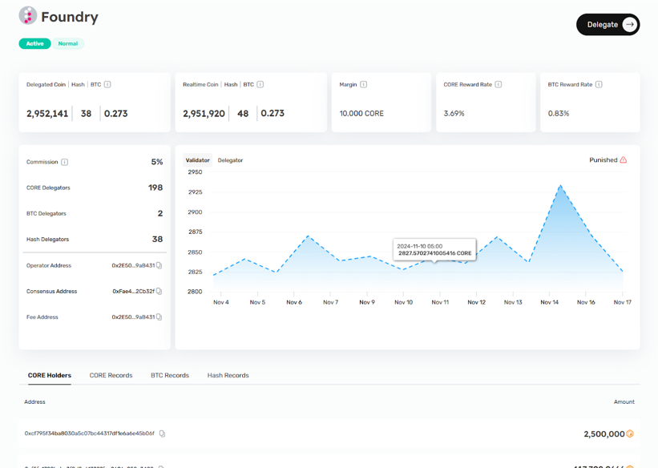
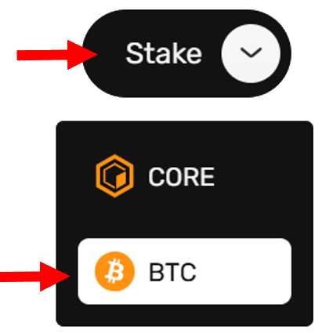
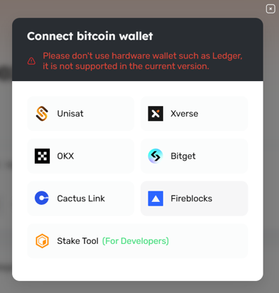
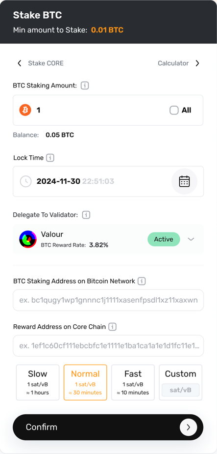
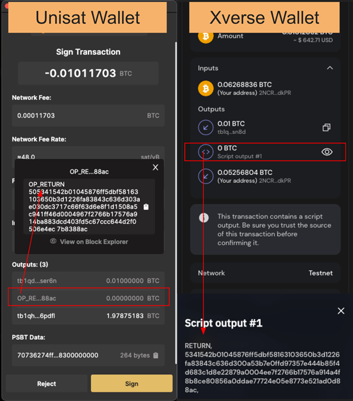
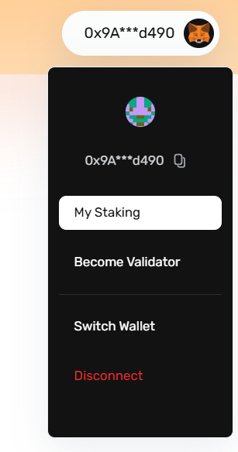
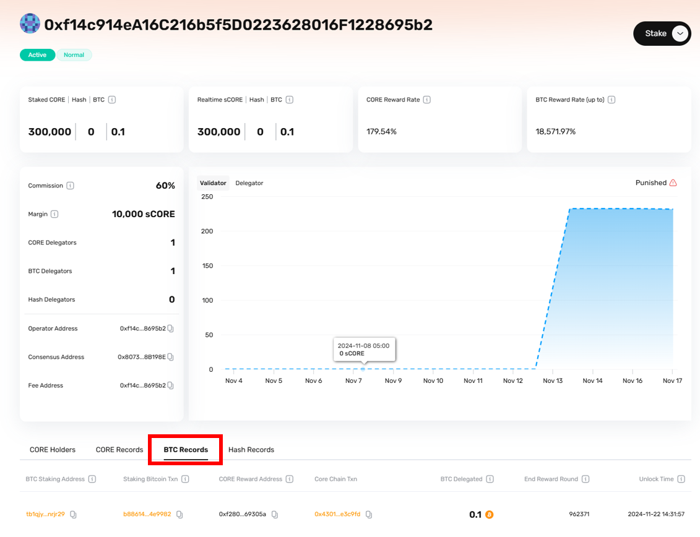

# Non-Custodial Bitcoin Staking

This user guide is designed to walk you through staking your Bitcoin on the Core blockchain to earn CORE token rewards. With Non-Custodial Bitcoin Staking, you can earn passive yield in CORE while retaining complete ownership of your Bitcoin assets. Let's dive into how it works and how you can start staking today.

## Prerequisites

To be able to stake, you must have the following prerequisites:

1. **Supported Bitcoin Wallet Browser Extension:** To participate in the BTC staking process, you must install browser extensions of any supported Bitcoin wallets, like [Xverse](https://chromewebstore.google.com/detail/xverse-wallet/idnnbdplmphpflfnlkomgpfbpcgelopg?hl=en-GB&authuser=1), [Unisat](https://chromewebstore.google.com/detail/unisat-wallet/ppbibelpcjmhbdihakflkdcoccbgbkpo), and/or [OKX Wallet](https://chromewebstore.google.com/detail/okx-wallet/mcohilncbfahbmgdjkbpemcciiolgcge) (visit stake.coredao.org for the latest supported wallets). You must use a desktop version, as mobile and hardware wallets are not currently supported. You can also stake directly using the [Element Wallet](https://www.elementwallet.com/) mobile application as well. 
2. **Core Wallet Address for Rewards:** Prepare your Core wallet address to receive CORE token rewards for staking Bitcoin. If you do not have a Core wallet address, you can quickly create one by connecting to MetaMask. For more information on configuring MetaMask to work with the Core network, follow the detailed guide [here](https://docs.coredao.org/docs/Dev-Guide/core-mainnet-wallet-config).

## **Key Considerations For BTC Staking**

The following are some key points that users should be careful about when staking their Bitcoin on Core.

1. **Minimum of 0.01 Bitcoin \+ Gas Fee:** To successfully stake your Bitcoin on Core, you need a minimum of 0.01 Bitcoin. In addition to the staking amount, users should consider the necessary gas fees in Bitcoin for executing transactions on the Bitcoin network. If you plan to stake for less than a month, having at least 0.05 Bitcoin is advisable. This extra amount helps cover potential network congestion, which can lead to higher gas prices than the rewards earned from staking.  
2. **Understanding the Differences in Bitcoin Staking Addresses:**  
   * The staking address in your Bitcoin wallet's transaction prompt may differ from your original Bitcoin address. This is because the Bitcoin staking address is derived from your Bitcoin wallet's master private key, ensuring control and security over your assets. Your Bitcoin remains safe in the Bitcoin staking address, unaffected by staking.   
3. **Delays in Locked Assets to Appear in your Bitcoin Wallet:**   
   * You may face some delays before your locked Bitcoin is displayed in your Bitcoin wallets. This delay primarily results from delays in transaction confirmation on the Bitcoin network, which can take several hours due to block time, the number of block confirmations required, and network congestion.   
   * While we are actively working with wallet partners to support the timely display of your assets in your wallets, you can check your locked assets on the ”MyStaking” page on Core’s staking website.   
   * You can also view your staked funds by searching the staking address on a Bitcoin explorer, [Mempool.space](https://mempool.space/).   
4. **Considerations for Locking Periods**  
   * Once you lock your Bitcoin for staking, it's inaccessible until the staking period concludes. Considering your investment objectives and risk tolerance, you are advised to select your locking period thoughtfully. Starting with shorter locking periods can help you become familiar with the process before committing to longer durations.

## Workflow of Non-Custodial BTC Staking

Non-custodial Bitcoin staking introduces a secure and decentralized method for Bitcoin holders to earn staking rewards. By locking your Bitcoin natively on the Bitcoin network through a time-bound mechanism, you can actively participate in the Core blockchain's Consensus mechanism while staking. Here are the steps involved in this process.

1. **Initiate Staking:** Start by accessing either the [CLI-based BTC Staking Tool](https://github.com/coredao-org/btc-staking-tool) (for technical users) or the [web-based staking platform](https://stake.coredao.org/) (for general users).   
2. **Stake Bitcoin with Time-Lock:** You stake your Bitcoin by sending a transaction on the Bitcoin network with a time-lock parameter, and your Bitcoin remains locked until the specified period ends. Ensure you follow the requirements for a transaction to be valid and eligible; refer [here](https://docs.google.com/document/d/1DfhLwMfANGYhcJe4UiyRJxpw1FvFX6k-QQK4cMYYOls/edit?tab=t.0#heading=h.mwjq55dgslw5) for more details.   
   1. There is no minimum staking period requirements, however, make sure to thoughtfully select your lockup periods.   
   2. Include the Core Validator Address to delegate your assets.  
   3. Include the Core wallet address for rewards.  
3. **Vote for Validators:** By including the address of the Core Validators in your transaction, you can delegate your staked Bitcoin to the chosen validator on the Core blockchain.  
4. **Connect a Core wallet for rewards:** In the return field, verify your Core wallet address; you'll receive CORE token rewards at this address.  
5. **Claiming Rewards:** Accrued CORE token rewards will also appear on the [staking site](http://stake.coredao.org/). CORE token rewards will appear when users connect their wallets, and can be claimed daily.   
6. **Redeem Bitcoin:** Once the staking lock time expires, the staked Bitcoin will remain idle in the staking address until redeemed by the user.

## Non-Custodial Bitcoin Staking Walkthrough 

To begin staking your Bitcoin on the Core blockchain and earn staking rewards in CORE tokens, follow the steps detailed below to stake Bitcoin through Core's official [staking website](http://stake.coredao.org/).

### Connect Core Wallet

1. Visit [https://stake.coredao.org](https://stake.coredao.org/) and click on **Validators** on the top header.

2. Click **Connect Wallet** in the top right corner of the header to connect your Core wallet. From the supported list of wallets, choose your desired Core wallet. For this walkthrough, we have used Metamask.

3. Confirm the wallet notification to allow to connect to the staking website.

### Selecting a Core Validator for Bitcoin Delegation

4. Once on the **Validators** page, scroll down to view the list of Core Validators and choose the Validator to whom you wish to delegate your Bitcoins. Please ensure to choose active validators.

5. By clicking on the name of the desired validator, you will be directed to the **Validator Details** page. This page displays details about the staking/delegation records for the selected validator.

6. Click on the **Stake** button, then select **BTC**

7. To connect your Bitcoin wallet, click on the supported wallet of your choice. For this walkthrough, we selected Unisat.  

8. Once your Bitcoin wallet is connected, it's important to understand and specify several key parameters:  
* Specify the amount of Bitcoin you’d like to delegate. The minimum amount to delegate is **0.01 Bitcoin**.  
* Setting the lock time determines when your staked Bitcoin will be unlocked and available again for redemption or re-delegation.  
  * You can input values by selecting inside the lock time box or clicking on the calendar icon to select the date and click “OK” to proceed.  
  * The default lock time is set to a month in advance.
* Specify the network priority speed for your transaction

9. Note that the **Reward Address on Core Chain** is pulled from the connected Core wallet. You should connect the Core wallet with the same address on which you want to receive staking rewards in CORE tokens.  
10. Click **Confirm** to complete the transaction.

### Confirm OP\_Return Output
11. Before Signing the transaction in your wallet, verify the transaction outputs to ensure they include an OP\_Return output. The OP\_Return output is where your redeem\_script is saved and is essentially used to redeem your staked Bitcoin. There may be two or three outputs, but at least one should always be OP\_Return. Abort the transaction if it doesn't include the OP\_Return output.

12. Once you confirm the transition, you will receive a **Transaction Submitted** notification. You can verify your transaction by clicking **View on BTC Explore**.

### Viewing Staking Records

13.  In the top right corner of the staking website, hover over your connected wallet and click **My Staking**.

14.  The **My Staking** page displays records of all your staking (CORE, BTC, and hash). Click on the **BTC Records** tab to show details of your BTC delegations.

**Congratulations!!** You have successfully staked your Bitcoin on the Core blockchain and will now actively earn CORE tokens from your delegated Bitcoin. Through staking Bitcoin and voting for validators on Core, you actively contribute to the governance and security of the Core network, supporting its decentralization and stability.
