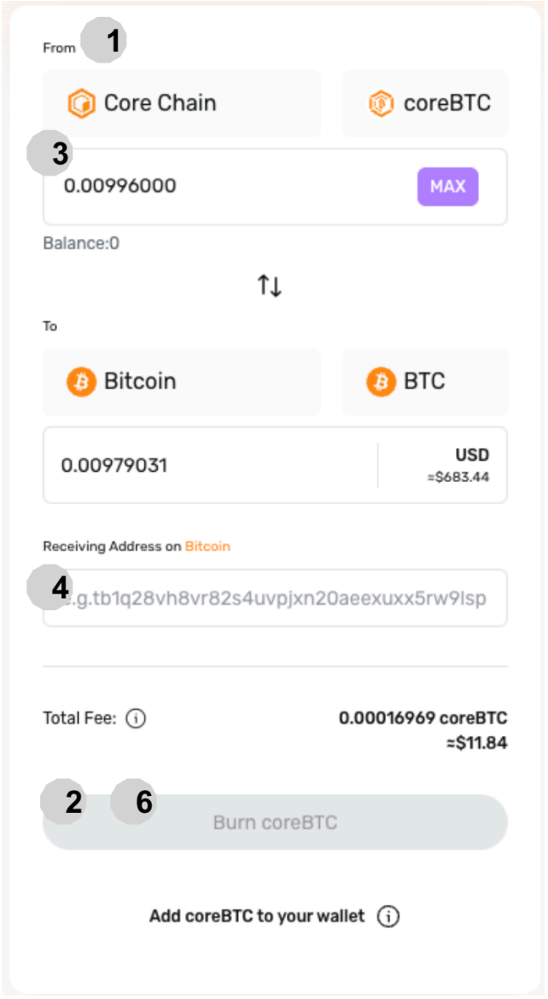

# Envolver y Desenrollar coreBTC

## Introducción

Como un Bitcoin envuelto nativo en Core, coreBTC mantiene una paridad 1:1 con Bitcoin a través de un mecanismo seguro, impulsado por una red de participantes descentralizados y sin permisos. Esta guía cubre los pasos esenciales para acuñar (envolver) y redimir (desenvolver) coreBTC, facilitando la integración de Bitcoin en las finanzas descentralizadas (DeFi).

## Empezando: Requisitos Previos

1. [Unisat Wallet Browser Extension](https://unisat.io/): Requerido para gestionar tu Bitcoin. Ten en cuenta que, actualmente, Unisat solo tiene aplicaciones de billetera para escritorio y Android.
2. [MetaMask](https://metamask.io/): Necesario para interactuar con la blockchain de Core.

## Acuñación de coreBTC

1. **Sitio Web de coreBTC:** Ve a https://bridge.coredao.org/coreBTC
2. **Especificar Conversión:** Indica que estás convirtiendo de Bitcoin (BTC) a coreBTC.
3. **Conectar Unisat Wallet:** Selecciona Conectar Unisat Wallet para vincular tu billetera de Bitcoin.
4. **Ingresar Monto de Bitcoin:** Introduce la cantidad de Bitcoin que deseas convertir a coreBTC.
5. **Dirección de Core:** Introduce tu dirección de billetera en la blockchain de Core.
6. **Ajustar la Tarifa:** Las tarifas predeterminadas están establecidas de acuerdo con las tasas de mercado actuales. Para una transacción más rápida, es esencial ajustar adecuadamente la tarifa de gas. Ten en cuenta que establecer una tarifa más alta puede acelerar significativamente la transacción. Por el contrario, si la tarifa se establece demasiado baja, la transacción podría experimentar retrasos considerables en su procesamiento, lo que podría llevar días o incluso más tiempo. Es crucial encontrar un equilibrio que se alinee con tu urgencia y la demanda actual de la red.
7. **Verificación:** Verifica todos los detalles, incluidas las cantidades, tarifas y direcciones de billetera.
8. **Acuñar:** Haz clic en 'Acuñar coreBTC' para iniciar la conversión.
9. **Añadir Token:** Selecciona 'Añadir coreBTC a tu billetera' en MetaMask para ver tu coreBTC.

## Redimir Bitcoin de coreBTC

1. **Sitio Web de coreBTC:** Ve a https://bridge.coredao.org/coreBTC
2. **Especificar Conversión:** Elige la conversión de coreBTC a Bitcoin (BTC).
3. **Conectar Billetera EVM:** Haz clic en Conectar Billetera EVM para vincular tu billetera.
4. **Ingresar Monto de coreBTC:** Especifica la cantidad de coreBTC que deseas redimir por Bitcoin.
5. **Dirección de Bitcoin de Destino:** Introduce la dirección de la billetera de Bitcoin de destino.
6. **Verificación:** Verifica todos los detalles, incluidas las cantidades, tarifas y direcciones de billetera.
7. **Quemar:** Haz clic en 'Quemar coreBTC' para iniciar el proceso de redención.

## Panel de Control: Monitoreo de Estado

1. **Transacciones Pendientes:** Visualiza y obtén detalles de las transacciones en curso.
2. **Transacciones Completadas:** Revisa el historial y los detalles de las transacciones finalizadas.
3. **Estados de Lockers:** Explora los lockers disponibles, incluyendo sus tarifas, colaterales, capacidad de acuñación y factor de salud. Los lockers son cruciales para asegurar el Bitcoin y están sujetos a sanciones o liquidación según su comportamiento y el estado de su colateral.
4. **Estados de Relayers:** Revisa la lista de relayers responsables de la transmisión y verificación de datos entre Bitcoin y la blockchain de Core.

:::note
Consulta la sección de [Preguntas Frecuentes de coreBTC](/i18n/es/docusaurus-plugin-content-docs/current/FAQs/coreBTC-faqs.md) para cualquier consulta que puedas tener.
:::
